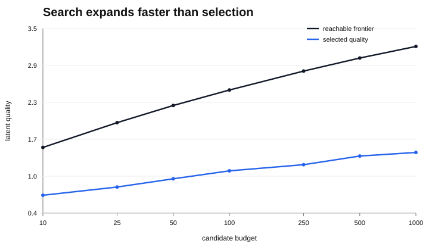
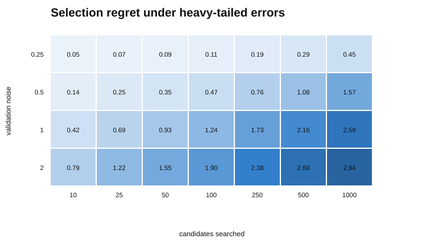
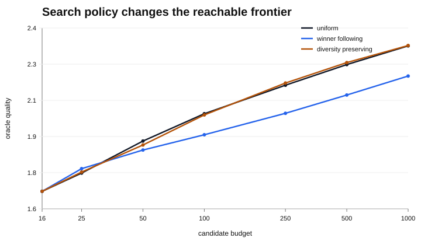
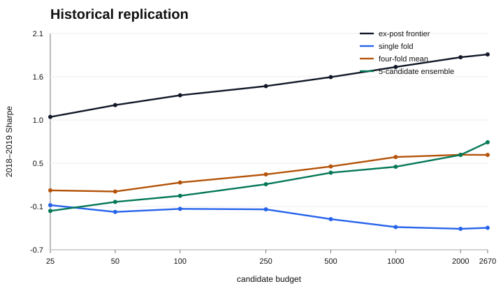

# selector-limitation

What happens when a research process gets better at generating candidates faster than it gets better at choosing among them?

For a candidate set of size `N`, let `Q_N` be the true quality of the best candidate discovered and `q_selected` the true quality of the candidate chosen from development evidence. The gap

```text
selection regret = Q_N - q_selected
```

is the object of study here.



## Main results

Under ordinary Gaussian validation noise, larger searches still improve the selected candidate, but the reachable frontier improves faster. Under heavy-tailed validation noise, the sign can reverse: with noise `2.0`, increasing the search from 10 to 1,000 candidates raises the oracle quality from **1.53 to 3.24** while selected quality falls from **0.74 to 0.30**.



Candidates are also grouped into correlated families. A winner-following search spends 95% of new proposals in the family containing the current validation winner; a diversity-preserving search mostly allocates to the least-sampled families.

At 1,000 proposals, winner-following leaves only **1.15 effective families** and reaches an oracle quality of **2.22**. Uniform and diversity-preserving search retain roughly eight effective families and reach **2.36**.



The historical check uses 2,670 generic price-only candidates on eight liquid ETFs, with 5 bps turnover costs. Development evidence ends in 2017; 2018–2019 is used only for evaluation.

| budget | ex-post frontier | single fold | four-fold mean | 5-candidate ensemble |
|---:|---:|---:|---:|---:|
| 25 | 1.05 | -0.09 | 0.10 | -0.16 |
| 500 | 1.57 | -0.27 | 0.41 | 0.33 |
| 1,000 | 1.70 | -0.37 | 0.53 | 0.41 |
| 2,670 | 1.86 | -0.38 | 0.56 | **0.73** |

The frontier is ex post: it measures what happened to be present in the candidate set and is never available to the selector.



A wider stress run across four two-year test periods and 12 fixed universes is less tidy. The reachable frontier rises from budget 25 to 2,670 in all 48 cells, but single-fold selection gets worse in 27 of them and four-fold mean selection in 25. The effect is therefore real but regime-dependent.

[RESULTS.md](RESULTS.md) has the fuller tables and setup.

## Reproduce

```bash
python -m pip install -e ".[dev]"
python -m selector_limitation.reproduce
```

That regenerates the synthetic sweeps and figures. To rerun the pinned historical data experiments as well:

```bash
python -m selector_limitation.reproduce --market
```

The market snapshot is downloaded from a pinned public commit and SHA-256 checked before use.

## Layout

```text
src/selector_limitation/   experiments and selectors
tests/                     invariants and timing checks
results/                   compact machine-readable outputs
figures/                   generated from results/
```

Python 3.11+; NumPy, Matplotlib, pytest and Ruff. Apache-2.0.
